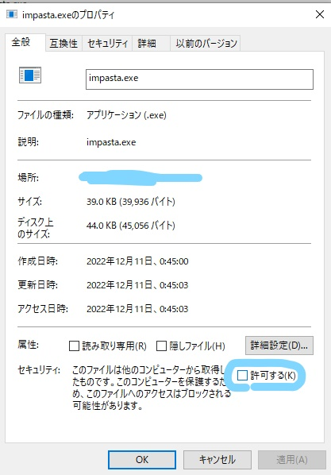

allow execution from property > security.

add below registry keys and impasta is available in the context menu.

|key|value|
|:-|:-|
|HKEY_CLASSES_ROOT/Directory/Background/shell/impasta|impasta|
|HKEY_CLASSES_ROOT/Directory/Background/shell/impasta/command|&lt;path/to/exe&gt;|
